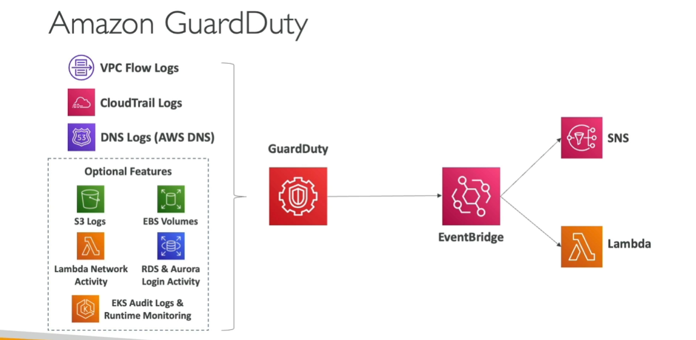

# Amazon GuardDuty

- Intelligent Threast Discovery to protect AWS Accounts
- Uses Machine learning algorithms, anamoly detection, 3rd party data
- Can set up EventBridge rules to be notifies in case of findings
- EventBridge rules can target AWS Lambda or SNS

[Difference between GuardDuty, Inspector and Macie](macie.md)

