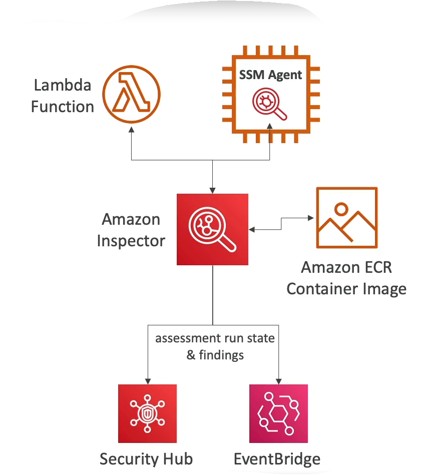

# Amazon Inspector

- Automated Security Assessments
    - For EC2 instances
    - For container Images push to Amazon ECR
    - For Lambda Functions
- Reporting & integration with AWS Security Hubd
- Send findings to Amazon Event Bridge

