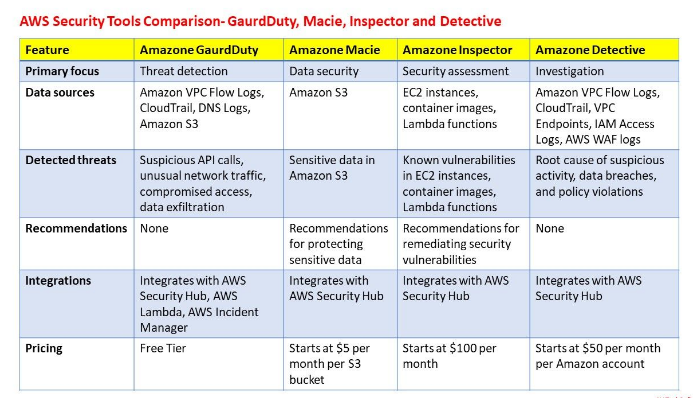

# Amazon Macie

- Uses machine learning and user behavior analytics to classify and protect sensitive data in Amazon S3. 
- Macie can identify data leaks, access control issues, and data exposures to help prevent data breaches and maintain compliance.

